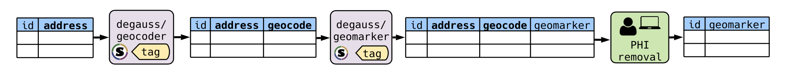

# DeGAUSS 

**De**centralized **G**eomarker **A**ssessment for M**u**lti-**S**ite **S**tudies  

*Questions? Problems? Please [file an issue](https://github.com/degauss-org/degauss-org.github.io/issues/new) on GitHub and see our [troubleshooting](https://github.com/degauss-org/degauss-org.github.io/wiki/Troubleshooting) guide.*

If you have used DeGAUSS, would you mind providing us some feedback and completing a short [survey](https://redcap.link/gvhbxfjd)?

## About

DeGAUSS is a decentralized method for geocoding and deriving community and individual level environmental characteristics while maintaining the privacy of protected health information. It is a standalone and versatile software application based on containerization.  This means that geomarker assessment is reproducible, standardized, and can be computed on at scale. Importantly, DeGAUSS is executable on a local machine -- it does not require extensive computational resources and PHI is never exposed to a third party or the internet, making it ideal for geomarker assessment in a multi-site study. Please see detailed documentation within the [wiki](https://github.com/degauss-org/degauss-org.github.io/wiki):

- [Background on geocoding, geomarkers, and private health information](https://github.com/degauss-org/degauss-org.github.io/wiki/Background)
- [Installing Docker](https://github.com/degauss-org/degauss-org.github.io/wiki/Installing-Docker)
- [Reproducibility and Versioning](https://github.com/degauss-org/degauss-org.github.io/wiki/Reproducibility-and-Versioning)
- [Geocoding with DeGAUSS](https://github.com/degauss-org/degauss-org.github.io/wiki/Geocoding-with-DeGAUSS)
- [Geomarker Assessment with DeGAUSS](https://github.com/degauss-org/degauss-org.github.io/wiki/Geomarker-Assessment-with-DeGAUSS)
- [Troubleshooting](https://github.com/degauss-org/degauss-org.github.io/wiki/Troubleshooting)
- [Microsoft Windows Troubleshooting and Workarounds](https://github.com/degauss-org/degauss-org.github.io/wiki/Microsoft-Windows-Troubleshooting-and-Workarounds)

## Currently Available Images

| **image** |  **description** | **container** | **version** |
|-----------|------------------|---------------|-------------|
[`degauss/geocoder`](https://degauss.org/geocoder) | batch geocoding |  | 
[`degauss/cchmc_batch_geocoder`](https://degauss.org/cchmc_batch_geocoder) | geocoding, census tract, deprivation index |  | 
[`degauss/census_block_group`](https://degauss.org/census_block_group) | census block group FIPS |  | 
[`degauss/roads`](https://degauss.org/roads) | proximity and length of major roads |  | 
[`degauss/greenspace`](https://degauss.org/greenspace) | enhanced vegetation index |  | 
[`degauss/geocoder_slim`](https://degauss.org/geocoder_slim) | API returning geocoded text string as JSON |  | 
[`degauss/PEPR_drivetime`](https://degauss.org/PEPR_drivetime) | distance and drive time to PEPR study sites |  | 

## Citation

If you use this software in a scientific publication, please consider citing one of our publications:

- Cole Brokamp, Chris Wolfe, Todd Lingren, John Harley, Patrick Ryan. Decentralized and Reproducible Geocoding and Characterization of Community and Environmental Exposures for Multi-Site Studies. *Journal of American Medical Informatics Association*. 25(3). 309-314. 2018. [*Download*](https://colebrokamp-website.s3.amazonaws.com/publications/Brokamp_JAMIA_2017.pdf).
- Cole Brokamp. DeGAUSS: Decentralized Geomarker Assessment for Multi-Site Studies. *Journal of Open Source Software*. 2018. [*Download*](https://colebrokamp-website.s3.amazonaws.com/publications/Brokamp_JOSS_2018.pdf).
