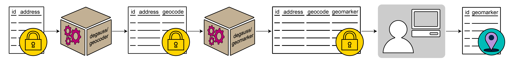

&nbsp;

### About 

DeGAUSS (**De**centralized **G**eomarker **A**ssessment for M**u**lti-**S**ite **S**tudies) is a decentralized method for geocoding and deriving community and individual level environmental characteristics while maintaining the privacy of protected health information. It is a standalone and versatile software application based on containerization.  This means that geomarker assessment is reproducible, standardized, and can be computed on at scale. Importantly, DeGAUSS is executable on a local machine -- it does not require extensive computational resources and PHI is never exposed to a third party or the internet, making it ideal for geomarker assessment in a multi-site study. 

### Using DeGAUSS

To get started using DeGAUSS, check out the 'Using DeGAUSS' tab above, or view our [available images](https://degauss.org/available_images). If you have any questions or problems, please first see our [troubleshooting](https://degauss.org/troubleshooting) guide and then open an issue within the corresponding [GitHub repository](https://github.com/degauss-org).

### Citation

If you use this software in a scientific publication, please consider citing one of our publications:

- Brokamp C, Wolfe C, Lingren T, Harley J, Ryan P. Decentralized and Reproducible Geocoding and Characterization of Community and Environmental Exposures for Multi-Site Studies. *Journal of American Medical Informatics Association*. 25(3). 309-314. 2018. [*Download*](https://colebrokamp-website.s3.amazonaws.com/publications/Brokamp_JAMIA_2017.pdf).
- Brokamp C. DeGAUSS: Decentralized Geomarker Assessment for Multi-Site Studies. *Journal of Open Source Software*. 2018. [*Download*](https://colebrokamp-website.s3.amazonaws.com/publications/Brokamp_JOSS_2018.pdf).

### Supported By

- NIH R01LM013222
- NIH U2COD023375
- The Harmony Project

### Trusted By 

