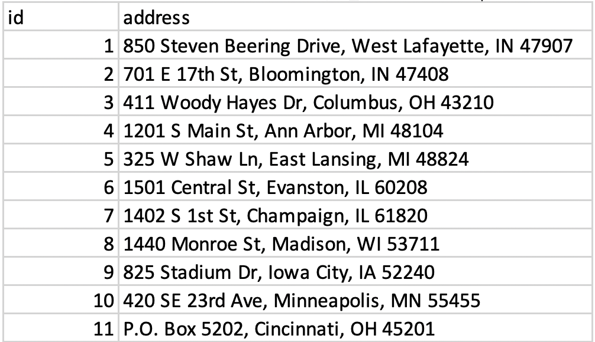
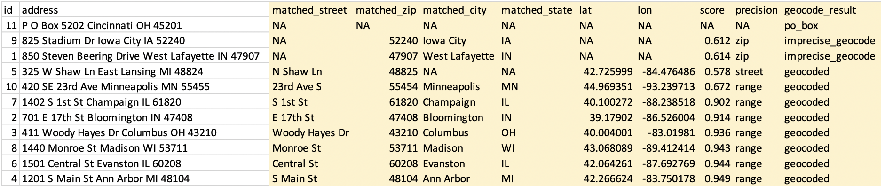
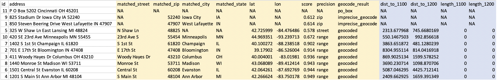
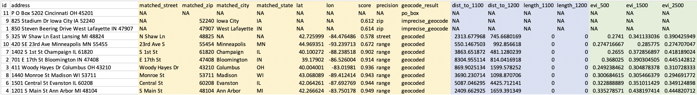
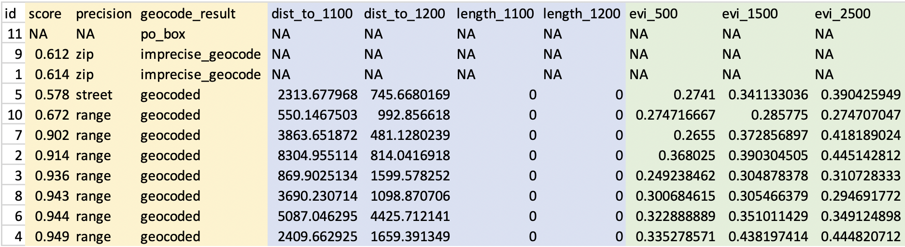

> Below is a step-by-step workflow used to estimate the length and proximity of major roadways as well as nearby greenness for a set of addresses

1. Start with your addresses in a .csv file, with the complete address in one column called “address”. For this example, that file will be called “sample_addresses.csv”.

{width=40%}

2. Use a DeGAUSS Docker command to geocode the addresses using version 3.0.2 of “degauss/geocoder”:

```sh
docker run --rm -v $PWD:/tmp degauss/geocoder:3.0.2 sample_addresses.csv
```
&nbsp- If you have not previously used this version of this image, Docker will first download it, which can take several minutes, depending on the size of the image and internet speeds. Docker will then create and run a container to geocode the addresses.  
  
3.	The results file, called “sample_addresses_geocoded_v3.0.2.csv”, will be written to the same folder where the input CSV file is located.
&nbsp-	This file is the same as the input CSV file, but with appended columns for matched address components, geocoding score and precision, latitude, longitude, and a categorical geocoding result. See [Interpretting geocoding results](https://degauss.org/using_degauss.html#Interpreting_geocoding_results) for more information on the geocoding results.



4.	Now that we have geocoded addresses, we can use DeGAUSS to add a geomarker. In this example we will use the DeGAUSS images for the proximity to major roadways and greenspace, DeGAUSS/roads version 0.1 and DeGAUSS/greenspace version 0.2. The programs can either be run in parallel on the geocoded file or they can be run sequentially, creating one file with both geomarkers. Here, we first added the roadway geomarker and then add greenspace to that result. This is done using the following commands while in the directory of the geocoded .csv file: 

```sh
docker run --rm -v "$PWD":/tmp degauss/roads:0.1 sample_addresses_geocoded_v3.0.2.csv
```


```sh
docker run --rm -v $PWD:/tmp degauss/greenspace:0.2 sample_addresses_geocoded_v3.0.2_roads_400m_buffer.csv
```



5.	These two DeGAUSS containers append new columns to our dataset with their respective geomarkers, while keeping intact our original dataset. Now that we have added our geomarkers, we can remove the addresses to create a geomarker dataset without geographic PHI. 



