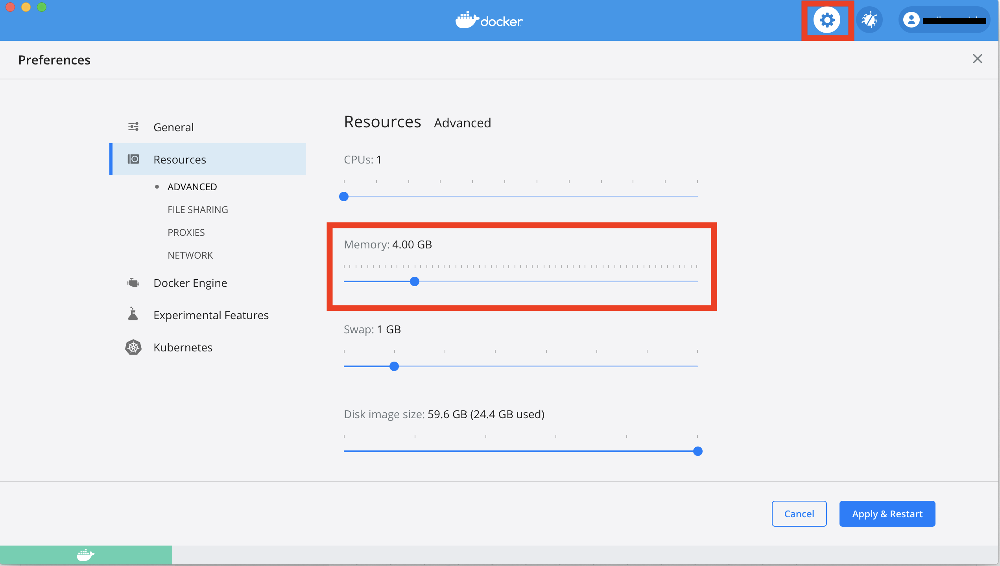

## PWD

**Problem**

Calling DeGAUSS results in an error along the lines of:

```
C:\Program Files\Docker\Docker\Resources\bin\docker.exe: invalid reference format.
See 'C:\Program Files\Docker\Docker\Resources\bin\docker.exe run --help'.
```

or DeGAUSS complains that it cannot find the `my_address.csv` file within the working directory of `/tmp`

**Solution**

In a DeGAUSS command, the `-v` argument tells Docker to bind the current directory to the `/tmp` directory inside a container so that it can read the input file and write the output file back to the current working directory on the host platform.

The Windows Command Line (`CMD`) does not support the `$PWD` environment variable and so instead of using that to specify the bind point (`-v $PWD:/tmp`) you will have to use a Command Line variable, `%cd`, for example: `-v %cd%:/tmp` or 

 `docker run --rm=TRUE -v "%cd%":/tmp degauss/pepr_roadways:0.3 my_address_file_geocoded.csv`

Please note that when you are using the command line variable, `%cd%`, your file path and filename cannot include spaces.

Alternatively, you can specify the full path to the folder, substituting `/` for `\`. For example: `-v 
C:/Temp/docker_testing:/tmp` or 
 
`docker run --rm=TRUE -v //c/Users/<your_username>/Desktop://tmp degauss/cchmc_batch_geocoder my_address_file.csv`

When using Windows PowerShell, by placing the `PWD` inside curly brackets, you are able to specify the current working directory. For example: `${PWD}` or

`docker run --rm -v ${PWD}:/tmp degauss/geocoder:3.0 my_address_file.csv`

**OneDrive:** If you or your institution use OneDrive, your working directory may have a different path than expected. If you have navigated to your Desktop using `cd Desktop` and your file cannot be found, or if you cannot navigate to your Desktop, use the instructions below to check your Desktop path. Alternatively, you could drag and drop your input file into the command prompt to view it's path. After locating your Desktop path, replace `Desktop` in `cd Desktop` with the new path. 

 

## Insufficient Memory

**Problem**

DeGAUSS seems to run without reporting any errors, but does not produce an output file. Intermediate directories (`Rtmp...`, `cache`, `degauss_cache`) directories are created, but the program seems to terminate prematurely.

**Solution**

Some of the DeGAUSS images require a large amount of system memory, or RAM, to complete the operation.  If insufficient memory is available to Docker, then the DeGAUSS image will fail without notifying the user.  This can be fixed by increasing the amount of RAM allocated to the virtual machine hosting Docker using Docker's settings.  These can usually be accessed through a menu found by right-clicking the Docker icon in the Windows Notifications area / System tray or the macOS Menu bar.



Docker running on the Windows Subsystem for Linux engine doesn't have these options, but can be set within the [`.wslconfig`](https://docs.microsoft.com/en-us/windows/wsl/wsl-config#wslconfig) file:

```
[wsl2]
kernel=C:\\temp\\myCustomKernel
memory=4GB # Limits VM memory in WSL 2 to 4 GB
processors=2 # Makes the WSL 2 VM use two virtual processors
```

## Registry Transition

**Problem** 

A DeGAUSS `docker run` command returns an error such as

```
Unable to find image 'degauss/aadt:0.1.1' locally
docker: Error response from daemon: manifest for degauss/aadt:0.1.1 not found: manifest unknown: manifest unknown.
```

**Solution**

Until December 2021, all DeGAUSS images were hosted using DockerHub and could be called using `degauss/<geomarker_name>:<version>`. Most DeGAUSS images (including current and previous versions) are now *also* hosted via the GitHub Container Registry. Beginning in December 2021, all newly created images will *only* be available on GitHub Container Registry and must be called using the full naming structure:

`ghcr.io/degauss-org/<geomarker_name>:<version>`

Refer to our list of [available images](https://degauss.org/available_images) for proper naming of each image. To see a full docker command with the appropriate image naming convention, follow the link from the available images table to the image's README page.

## Microsoft Excel

Opening an input CSV file in Microsoft Excel can change column formats resulting in incorrect results from DeGAUSS containers. If opening the CSV in Excel before feeding it to a container cannot be avoided, please follow the guidelines below for ensuring columns are formatted properly.

#### 1. Dates

Excel autoformats dates, usually as `MM/DD/YY`, regardless of the format in which the user supplied the date. Further, Excel will *display* a date in that format even if the actual *value* is stored in a different format. 

DeGAUSS containers work best when dates are formatted as `YYYY-MM-DD`. You can change this format manually in Excel.

Highlight your date column(s) and select "More Number Formats". Then, under **Date** formatting, select the `YYYY-MM-DD` format and click OK. 


<br>

#### 2. Large numbers

Excel will often display large numbers in scientific notation. If large numbers do not remain formatted numerically, some digits could be stored as zeros, (e.g., the number 123456789 could be stored as 1.2E8, which could then be converted to 120000000). 

Similar to formatting the dates, you can manually format large numbers in Excel. 


#### Excel display vs. actual cell values

Excel's display will probably not show these changes if the file is saved, closed, and re-opened. One way to see the actual values of the csv file, is to open with a simple text editor, like notepad or TextEdit. 


## Docker Containers for Windows

**Problem** 

Within Windows terminal, trying to pull or run a Docker container results in an error: `docker image operating system "linux" cannot be used on this platform`

*or*

DeGAUSS (or `docker run hello-world`) returns an error along the lines of `no matching manifest for windows/amd64 in the manifest list entries`

**Solution**

Switch Docker settings to use Linux Containers instead of Windows Containers. Follow these steps: 


screenshot from this [stackoverflow post](https://stackoverflow.com/questions/48066994/docker-no-matching-manifest-for-windows-amd64-in-the-manifest-list-entries)

## Parallel Computing on Windows

### Problem

When running a DeGAUSS container on Windows it results in an error:

```
Error in fifo(tempfile(), open = "w+b", blocking = T) :
  cannot open the connection
Execution halted
```

### Solution

This error occurs because some Windows platforms cannot support the R code used for parallel computing.  Although this option is enabled by default and cannot be changed by the user, a workaround is to set the Docker host to use only 1 CPU.  This can be done in the Docker settings panel and will force the container to use only a single thread.


## Proxy

**Problem**

DeGAUSS (or `docker run hello-world`) returns an error along the lines of `x509: certificate signed by unknown authority`

**Solution**

DeGAUSS users from research institutions with networks that contact the internet through a proxy often face this problem.  The root problem is that the Docker virtual machine does not have access to the certificates installed on the host machine.

A lot of institutions responsible for protecting PHI will “intercept” incoming and outgoing internet traffic by appending their own certificates in order to sniff the data that is traveling between a computer and the internet on their network.  Thus, when a user attempts to use the institution’s network to contact an HTTPS site with a computer that doesn’t have the right security certificates (such as is the case here with the virtual machine running Docker), the browser or download protocol will usually refuse because the mismatched certificates are a red flag that someone is trying to “man in the middle” attack the user.  This isn’t a problem unique to Docker — browsing any HTTPS site, e.g. google.com, will return the error if this is the case.

The long fix is to update Docker to utilize the institution's proxy, either through environment variables passed at call time or in the Docker settings.  The short fix is to run the Docker commands while connected to a network not connected to a proxy.  Assuming this is compliant with the institution’s rules on PHI (it usually is), then you can do this by using your institution’s guest network, your own personal network at home, or another “public” wireless network.

Note that this wouldn’t necessarily require any of the PHI to be on the computer when its connected to non-proxied network. A workaround could be to connect to a different network to `docker pull` the image and then `docker run` after switching to the institutional network and adding the data back to the machine. Once an image is pulled, the container can be successfully run without internet access.

