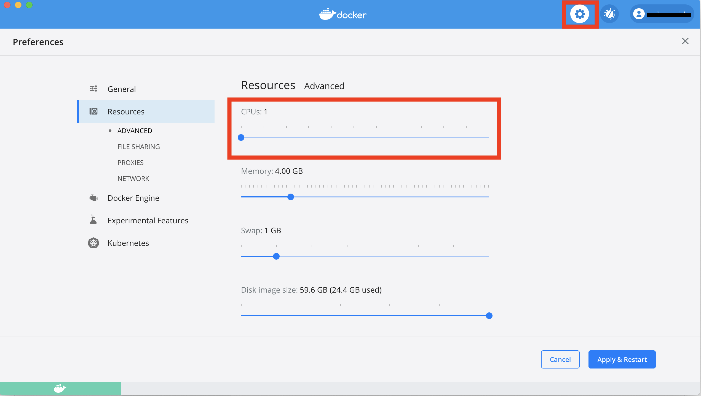
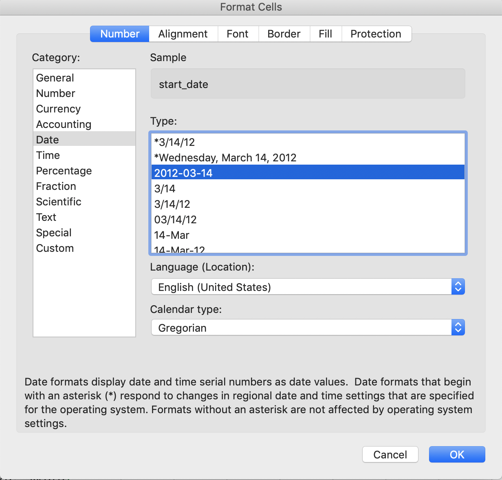
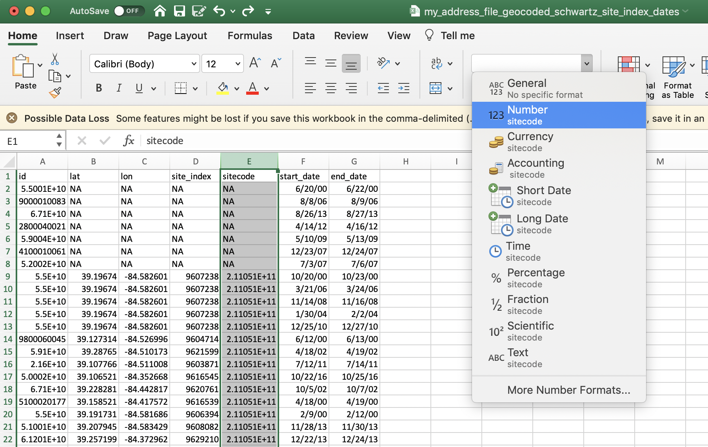

# Insufficient Memory

__Problem__

DeGAUSS seems to run without reporting any errors, but does not produce an output file. Intermediate directories (`Rtmp...`, `cache`, `degauss_cache`) directories are created, but the program seems to terminate prematurely.

__Solution__

Some of the DeGAUSS images require a large amount of system memory, or RAM, to complete the operation.  If insufficient memory is available to Docker, then the DeGAUSS image will fail without notifying the user.  This can be fixed by increasing the amount of RAM allocated to the virtual machine hosting Docker.  This can be done using the installation wizard, the Docker control panel, or settings in VirtualBox, all depending on the version of Docker and version of OS running Docker.


# Proxy and Virtual Private Networks

__Proxy__

__Problem__

DeGAUSS (or `docker run hello-world`) returns an error along the lines of `x509: certificate signed by unknown authority`

__Solution__

DeGAUSS users from research institutions with networks that contact the internet through a proxy often face this problem.  The root problem is that the Docker virtual machine does not have access to the certificates installed on the host machine.

A lot of institutions responsible for protecting PHI will “intercept” incoming and outgoing internet traffic by appending their own certificates in order to sniff the data that is traveling between a computer and the internet on their network.  Thus, when a user attempts to use the institution’s network to contact an HTTPS site with a computer that doesn’t have the right security certificates (such as is the case here with the virtual machine running Docker), the browser or download protocol will usually refuse because the mismatched certificates are a red flag that someone is trying to “man in the middle” attack the user.  This isn’t a problem unique to Docker — browsing any HTTPS site, e.g. google.com, will return the error if this is the case.

The long fix is to update Docker to utilize the institution's proxy, either through environment variables passed at call time or in the Docker settings.  The short fix is to run the Docker commands while connected to a network not connected to a proxy.  Assuming this is compliant with the institution’s rules on PHI (it usually is), then you can do this by using your institution’s guest network, your own personal network at home, or another “public” wireless network.

Note that this wouldn’t necessarily require any of the PHI to be on the computer when its connected to non-proxied network. A workaround could be to connect to a different network to `docker pull` the image and then `docker run` after switching to the institutional network and adding the data back to the machine. Once an image is pulled, the container can be successfully run without internet access.

__Virtual Private Networks__

__Problem__

Docker container cannot read files from a host folder mounted via the volume (`-v`) flag. For DeGAUSS, this means that a container might not be able to find the input file and will error with `cannot open file 'my_address_file.csv': No such file or directory`.

__Solution__

VPN clients (e.g., Cisco AnyConnect) disrupt the networking that Docker uses to talk to other containers and to the host file system, resulting in a failure to mount any host folders to any containers. Disable any Virtual Private Network (VPN) connection while running Docker and DeGAUSS to avoid this problem.

# Specifying the Container Registry

__Problem__ 

A DeGAUSS `docker run` command returns an error such as

```
Unable to find image 'degauss/aadt:0.1.1' locally
docker: Error response from daemon: manifest for degauss/aadt:0.1.1 not found: manifest unknown: manifest unknown.
```

__Solution__

Until December 2021, all DeGAUSS images were hosted using DockerHub and could be called using `degauss/<geomarker_name>:<version>`. Most DeGAUSS images (including current and previous versions) are now *also* hosted via the GitHub Container Registry. Beginning in December 2021, all newly created images will *only* be available on GitHub Container Registry and must be called using the full naming structure:

`ghcr.io/degauss-org/<geomarker_name>:<version>`

Refer to our list of [available images](https://degauss.org/available_images) for proper naming of each image. To see a full docker command with the appropriate image naming convention, follow the link from the available images table to the image's README page.

# Microsoft Windows Troubleshooting and Workarounds

Compared to running DeGAUSS on a macOS or linux system, there are a few known issues and workarounds for using DeGAUSS on Microsoft Windows:

## Specifying the `$PWD` when binding a volume

__Problem__

Calling DeGAUSS results in an error along the lines of:

```
C:\Program Files\Docker\Docker\Resources\bin\docker.exe: invalid reference format.
See 'C:\Program Files\Docker\Docker\Resources\bin\docker.exe run --help'.
```

or DeGAUSS complains that it cannot find the `my_address.csv` file within the working directory of `/tmp`

__Solution__

The point of the -v argument is to bind the current directory to the “/tmp” directory inside of the container so that the code inside can find the input files and write the output file back to the current working directory on the host platform.

The Windows Command Line (`cmd`) does not support the `$PWD` environment variable and so instead of using that to specify the bind point (`-v $PWD:/tmp`) you will have to use a Command Line variable, `%cd`, for example: `-v %cd%:/tmp` or 

 `docker run --rm=TRUE -v "%cd%":/tmp degauss/pepr_roadways:0.3 my_address_file_geocoded.csv`

Alternatively, you can specify the full path to the folder, substituting `/` for `\`. For example: `-v 
C:/Temp/docker_testing:/tmp` or 
 
`docker run --rm=TRUE -v //c/Users/<your_username>/Desktop://tmp degauss/cchmc_batch_geocoder my_address_file.csv`

When using Windows PowerShell, by placing the `PWD` inside curly brackets, you are able to specify the current working directory. For example: `${PWD}` or  

`docker run --rm -v ${PWD}:/tmp degauss/geocoder:3.0 my_address_file.csv`

## Docker Containers for Windows

__Problem__ 

Within Windows terminal, trying to pull or run a Docker container results in an error: `docker image operating system "linux" cannot be used on this platform`

__Solution__

By default, Docker for Windows is setup to run Windows Containers and is not compatible with Linux Containers. To change this setting, right click on the Docker logo in the toolbar menu and choose `Switch to Linux Containers...`

## Parallel Computing on Windows

__Problem__

When running a DeGAUSS container on Windows it results in an error:

```
Error in fifo(tempfile(), open = "w+b", blocking = T) :
  cannot open the connection
Execution halted
```

__Solution__

This error occurs because some Windows platforms cannot support the R code used for parallel computing.  Although this option is enabled by default and cannot be changed by the user, a workaround is to set the Docker host to use only 1 CPU.  This can be done in the Docker settings panel and will force the container to use only a single thread.



## Insufficient Memory

__Problem__

DeGAUSS seems to run without reporting any errors, but does not produce an output file. Intermediate directories (Rtmp..., cache, degauss_cache) directories are created, but the program seems to terminate prematurely.

__Solution__

If using an older version of Docker built using the Hyper-V engine, you can allocate more memory to Docker to complete the task. From your Docker dashboard, navigate to the settings. Under "Resources" and "Advanced", adjust the slider to increase the amount of memory available to Docker. More information is available [here](https://docs.docker.com/docker-for-windows/), under "Resources".


However, if your Docker is built using the WSL 2 engine, these options are not available. If you do not see the above screen, you will have to manually allocate more memory to Docker using the instructions found [here](https://docs.microsoft.com/en-us/windows/wsl/wsl-config#configure-global-options-with-wslconfig), under "Configure global options with .wslconfig". 

```
[wsl2]
kernel=C:\\temp\\myCustomKernel
memory=4GB # Limits VM memory in WSL 2 to 4 GB
processors=2 # Makes the WSL 2 VM use two virtual processors
```

More information about the WSL 2 version of Docker is provided [here](https://docs.docker.com/docker-for-windows/wsl/).

## No Windows 10

__Problem__

The only computers available to use DeGAUSS are Windows machines that do not have Windows 10 on them.  Docker CE only supports Windows machines with Windows 10 or greater.

__Solution__

Install Docker Toolbox, which is a legacy supported solution to using Docker on systems that don't support Hyper-V: https://docs.docker.com/toolbox/toolbox_install_windows/

After installation, double-click the Docker Quickstart icon on the Desktop to launch a pre-configured Docker toolbox terminal and proceed as usual.

## Windows Containers vs. Linux Containers

__Problem__ 

DeGAUSS (or `docker run hello-world`) returns an error along the lines of `no matching manifest for windows/amd64 in the manifest list entries`

__Solution__

Switch Docker settings to use Linux Containers instead of Windows Containers. Follow these steps: 


screenshot from this [stackoverflow post](https://stackoverflow.com/questions/48066994/docker-no-matching-manifest-for-windows-amd64-in-the-manifest-list-entries)

# Excel Formatting for DeGAUSS

Opening an input CSV file in Microsoft Excel can change column formats resulting in incorrect results from DeGAUSS containers. If opening the CSV in Excel before feeding it to a container cannot be avoided, please follow the guidelines below for ensuring columns are formatted properly.

## 1. Dates

Excel autoformats dates, usually as `MM/DD/YY`, regardless of the format in which the user supplied the date. Further, Excel will *display* a date in that format even if the actual *value* is stored in a different format. 

DeGAUSS containers work best when dates are formatted as `YYYY-MM-DD`. You can change this format manually in Excel.

Highlight your date column(s) and select "More Number Formats". Then, under **Date** formatting, select the `YYYY-MM-DD` format and click OK. 




<br>

## 2. Large numbers

Excel will often display large numbers in scientific notation. If large numbers do not remain formatted numerically, some digits could be stored as zeros, (e.g., the number 123456789 could be stored as 1.2E8, which could then be converted to 120000000). 

Similar to formatting the dates, you can manually format large numbers in Excel. 



## Excel display vs. actual cell values

Excel's display will probably not show these changes if the file is saved, closed, and re-opened. One way to see the actual values of the csv file, is to open with a simple text editor, like notepad or TextEdit. 


