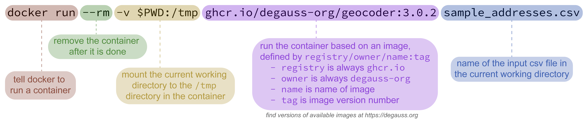
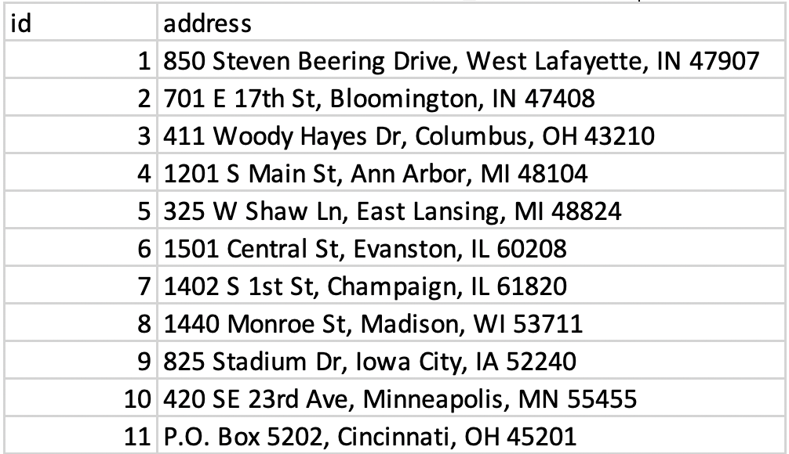
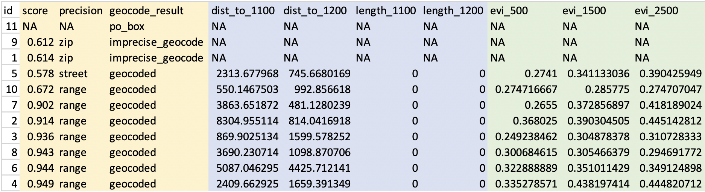

## Installing Docker

Getting started with Docker requires installing "Docker Desktop" on a Windows or macOS machine or a "Docker Engine" on a Linux operating system. Follow the [official installation instructions](https://docs.docker.com/desktop/) specific to your operating system. Docker also has detailed installation guides, user manuals, and troubleshooting for both [macOS](https://docs.docker.com/desktop/mac/install/) and [Windows](https://docs.docker.com/desktop/windows/install/).

To test your installation, open a shell and run `docker run hello-world`. (See the next section for details on using a shell for command line instructions if you are unfamiliar.) You should see some output describing what Docker did and that it is working correctly:

    $ docker run hello-world

    Unable to find image 'hello-world:latest' locally
    latest: Pulling from library/hello-world
    ca4f61b1923c: Pull complete
    Digest: sha256:ca0eeb6fb05351dfc8759c20733c91def84cb8007aa89a5bf606bc8b315b9fc7
    Status: Downloaded newer image for hello-world:latest

    Hello from Docker!
    This message shows that your installation appears to be working correctly.
    ...

Notice that after asking Docker to run a container, if it does not find the image locally, it downloads it from an online repository. This is only necessary the first time you run a container from each image. Once downloaded, Docker will continue to use the same local image to create containers.

## Command Line

> If you are comfortable using the command line, please [skip to DeGAUSS Commands](using_degauss.html#DeGAUSS_Commands).

DeGAUSS is operated through a command line interface by using a [shell](https://en.wikipedia.org/wiki/Shell_%28computing%29) to issue Docker commands. If using macOS, access the command line by opening the "Terminal" application. For Windows, use the "Command Prompt" (sometimes abbreviated as "CMD") or "Windows Powershell". An alternative on Windows is to use a Linux shell through the [Windows Subsystem for Linux](https://www.makeuseof.com/tag/linux-bash-shell-on-windows-10/).

Commands typed into a shell operate relative to a "working directory". This allows us to access the input file by specifying its name without the full path including all parent folders/directories, *but* this requires us to first navigate to the directory on our computer where the input file is located.

After opening a new shell, navigate to the folder/directory where the input file is stored by using the `cd` command (for **c**hange **d**irectory). For example, use `cd Users/Alice/Documents/my_project` to change to the `my_project` directory in `Alice`'s `Documents` folder. (File/folder browsers in macOS and Windows often have a secondary click contextual menu option to copy the path to the current folder, which is usefuly for constructing `cd` commands in a shell.)

For more information on the command line, see these useful tuturials for [macOS](https://www.taniarascia.com/how-to-use-the-command-line-for-apple-macos-and-linux/) and [Windows](https://www.makeuseof.com/tag/a-beginners-guide-to-the-windows-command-line/).

After succesfully navigating to the folder where the input file is stored, you are ready to use a DeGAUSS command.

## DeGAUSS Commands

DeGAUSS commands are essentially Docker commands with some specified arguments. Below, an example command is broken into color-coded annotated sections.



To use this generally for any DeGAUSS application, `my_address_file.csv` would be replaced by the name of your csv file located in the current working directory of your shell. `geocoder` and `3.0.2` would be replaced by the name and version, respectively, of the [degauss container](available_images.html) you would like to run.

One caveat for using DeGAUSS commands on Windows is the use of the `$PWD` variable, which relies on the convention that the shell will evaluate this as the current working directory. If using Windows Command Prompt (but not Windows Powershell or Windows Subsystem for Linux), this variable is not present and instead must be changed to `%cd%`. Windows Powershell users may have to use `${PWD}`, please see [here](troubleshooting.html#Windows) for more details on `$PWD` for different Windows operating systems.

## Geocoding

#### Input address data formatting

Addresses must be stored as a `CSV` file and follow these formatting requirements:

-   Other columns may be present, but it is recommended to only include `address` and an optional identifier column (e.g., `id`). Fewer columns will increase geocoding speed.
-   Address data must be in one column called `address`.
-   Separate the different address components with a space
-   If you are editing your .csv file using something *other* than Excel and you have commas in your address, make sure the full address is in quotes
-   Do not include apartment numbers or "second address line" (but its okay if you can't remove them)
-   ZIP codes must be five digits (i.e. `32709`) and not "plus four" (i.e. `32709-0000`)
-   Do not try to geocode addresses without a valid 5 digit zip code; this is used by the geocoder to complete its initial searches and if attempted, it will likely return incorrect matches
-   Spelling should be as accurate as possible, but the program does complete "fuzzy matching" so an exact match is not necessary
-   Capitalization does not affect results
-   Abbreviations may be used (i.e. `St.` instead of `Street` or `OH` instead of `Ohio`)
-   Use arabic numerals instead of written numbers (i.e. `13` instead of `thirteen`)
-   Address strings with out of order items could return NA (i.e. `3333 Burnet Ave Cincinnati 45229 OH`)

#### Using the DeGAUSS geocoder

1.  Make sure Docker is running and open a new shell.

2.  Navigate to the directory where your address file is located.

3.  Enter the DeGAUSS command. See the example below:

If `my_address_file.csv` is a file in the current working directory with an address column named `address`, then

``` sh
docker run --rm -v $PWD:/tmp ghcr.io/degauss-org/geocoder my_address_file.csv
```

will produce `my_address_file_geocoded_v3.0.csv` with added columns including `lat`, `lon`, and geocoding diagnostic information.

Note: DeGAUSS geocoded 50,000 addresses in about 30 minutes using Docker Desktop with 6 CPUs and 10 GB of shared memory on a 15-inch, 2019 MacBook Pro with a 2.6 GHz Intel Core i7 processor.

#### Interpreting geocoding results

The geocoder's output file includes the following columns:

-   `matched_street`, `matched_city`, `matched_state`, `matched_zip`: matched address componets (e.g., `matched_street` is the street the geocoder matched with the input address); can be used to investigate input address misspellings, typos, etc.

-   For more detailed information on the interpretation of the geocoding results, please see [degauss.org/geocoder](https://degauss.org/geocoder)

## Geomarker Assessment

The geomarker assessment images will only work with the output of the geocoding docker image (or a CSV file with columns named `lat` and `lon`). Similar to before, navigate to the directory where the geocoded CSV file is located. If you are running geomarker assessment right after geocoding and using the same shell, the files will be in the same location, so no further navigation is necessary.

Run:

    docker run --rm -v "$PWD":/tmp ghcr.io/degauss-org/<name-of-image> <name-of-geocoded-file>

Continuing with our usage example, if we wanted to calculate the distance to the nearest road and length of roads within a 400 m buffer for each subject, we could use the [degauss/roads](https://degauss.org/roads/) image:

    docker run --rm -v "$PWD":/tmp ghcr.io/degauss-org/roads my_address_file_geocoded.csv

Docker will emit some messages as it progresses through the calculations and will again write the file to the working directory with a descriptive name appended, in this case the distance to nearest primary (`dist_to_1100`) and secondary (`dist_to_1200`) roads and the length of primary (`length_1100`) and secondary (`length_1200`) roads within a 400 m buffer.

Again, our output file will be written into the same directory as our input file. In our example above, this will be called `my_address_file_geocoded_roads.csv`:

| id  | address                                 | lat      | lon       | dist_to_1100 | dist_to_1200 | length_1100 | length_1200 |
|---------|---------|---------|---------|---------|---------|---------|---------|
| 131 | 1922 CATALINA AV CINCINNATI OH 45237    | 39.17112 | -84.46176 | 502.7        | 534.8        | 0           | 0           |
| 540 | 5358 LILIBET CT DELHI TOWNSHIP OH 45238 | 39.11552 | -84.61902 | 5793.1       | 1654.7       | 0           | 0           |
| 112 | 630 GREENWOOD AV CINCINNATI OH 45229    | 39.15321 | -84.49236 | 1453.0       | 548.5        | 0           | 0           |

Please note that the geomarker assesment programs will return `NA` for geomarkers when coordinate values are missing. Missing coordinate values are possible if the geocoding container failed to assign them, for example, when using a malformed address string. A user should verify that the address strings have been recorded correctly; however, geocoding sometimes fails even with a correctly supplied address due to inconsistencies and inaccuracies in the street range files provided by the census.

## Removing PHI

Now that we have our desired geomarkers, we can remove the addresses and coordinates from our output file, leaving only the geomarker information that will be associated with health outcomes in a downstream analysis:

| id  | dist_to_1100 | dist_to_1200 | length_1100 | length_1200 |
|-----|--------------|--------------|-------------|-------------|
| 131 | 502.7        | 534.8        | 0           | 0           |
| 540 | 5793.1       | 1654.7       | 0           | 0           |
| 112 | 1453.0       | 548.5        | 0           | 0           |

In theory, since this file no longer contains any PHI, it is no longer subject to HIPAA and can be shared with others or used with third party online services. In reality, we are applying the "Safe Harbor" method defined by HIPAA for deidentification, but re-identification is certainly possible when enough geomarkers and non-identifying information are combined together. Do not take the use of DeGAUSS as a guarantee of deidentification and please consult your institution for more information relating to their specific policies around sharing data.

## A Sample Workflow

> Below is a step-by-step workflow used to estimate the length and proximity of major roadways as well as nearby greenness for a set of addresses.
>
> For an animated GIF of these commands, check out the [DeGAUSS homepage](index.html).

1.  Start with your addresses in a .csv file, with the complete address in one column called "address". For this example, that file will be called "sample_addresses.csv".

{width="40%"}

2.  Use a DeGAUSS Docker command to geocode the addresses using version 3.0.2 of "degauss/geocoder". If you have not previously used this version of this image, Docker will first download it, which can take several minutes, depending on the size of the image and internet speeds. Docker will then create and run a container to geocode the addresses.

``` sh
docker run --rm -v $PWD:/tmp ghcr.io/degauss-org/geocoder sample_addresses.csv
```

3.  The results file, called "sample_addresses_geocoded_3.3.0_score_threshold_0.5.csv", will be written to the same folder where the input CSV file is located. This file is the same as the input CSV file, but with appended columns for matched address components, geocoding score and precision, latitude, longitude, and a categorical geocoding result. See [Interpreting geocoding results](https://degauss.org/using_degauss.html#Interpreting_geocoding_results) for more information on the geocoding results.


4.  Now that we have geocoded addresses, we can use DeGAUSS to add a geomarker. In this example we will use the DeGAUSS images for the proximity to major roadways and greenspace, DeGAUSS/roads version 0.1 and DeGAUSS/greenspace version 0.2. The programs can either be run in parallel on the geocoded file or they can be run sequentially, creating one file with both geomarkers. Here, we first added the roadway geomarker and then add greenspace to that result. This is done using the following commands while in the directory of the geocoded .csv file:

``` sh
docker run --rm -v "$PWD":/tmp ghcr.io/degauss-org/roads sample_addresses_geocoded_3.3.0_score_threshold_0.5.csv
```


``` sh
docker run --rm -v $PWD:/tmp ghcr.io/degauss-org/greenspace sample_addresses_geocoded_3.3.0_score_threshold_0.5_roads_400m_buffer.csv
```


5.  These two DeGAUSS containers append new columns to our dataset with their respective geomarkers, while keeping intact our original dataset. Now that we have added our geomarkers, we can remove the addresses to create a geomarker dataset without geographic PHI.


